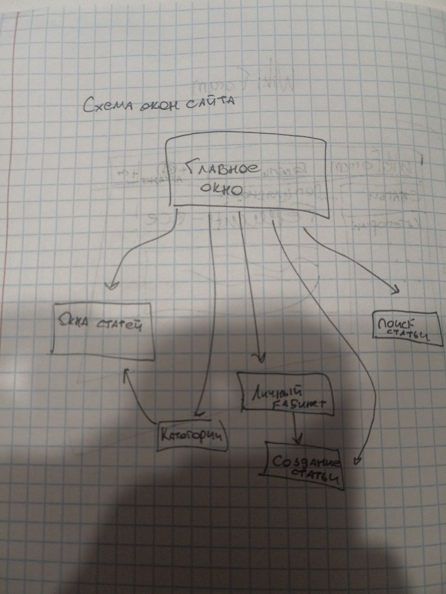
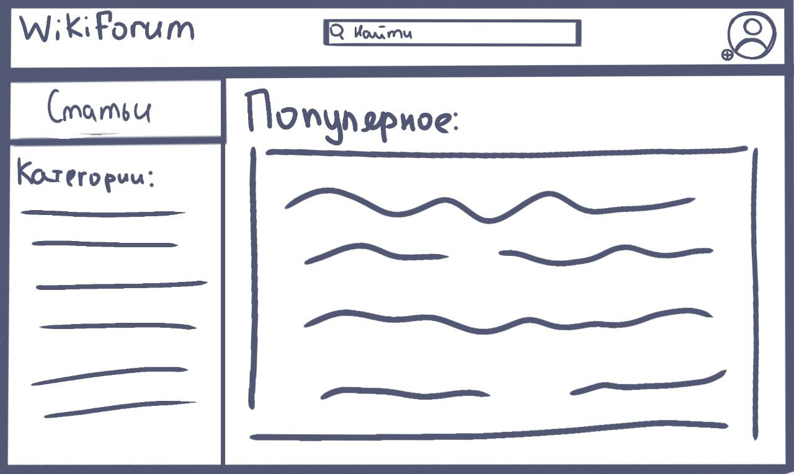

1. Project name: 
    - Cosmic raids
2. Команда
    - Team lead: 
   > Жаворонков Егор Дмитриевич; 
   - Project developers: 
   > Кульпинская Елена, Кононов Александр
3. Описание проекта:
     - WikiForum - это сайт для людей, которые хотят поделиться знаниями или же получить их.
    Здесь вы можете выложить свою статью, создать новое ответвление со
     своей темой и комментироать статьи других пользователей.
    - Когда пользователь заходит на сайт, перед ним открывается главное окно. На нем 
   расположен каталог тем, окно поиска статей, и большую часть экрана 
   занимают самые популярные статьи
   - Так же доступна кнопка "Создать статью", и после прочтения статьи будет возможность
   оставить комментарий
4. Структура проекта
   - Структура окон сайта:
   - 
5. Описание кода
   - Файл main.py - в нем будут функции, отвечающие за окна сайта, реализованные при помощи flask
   - data - папка с основным кодом проекта. Все классы и управление базами данных будет там
   - Классы:
   - > В проекте будут реализованы такие классы, как: статьи, пользователи, категории статей и тд. Так же данные пользователей, 
   статьи и другие данные будут реализованы через библиотеку sqlalchemy как таблицы. У каждого пользователя будут 
   статьи, написанные им, у статей же в свою очередь будет автор - ссылка на пользователя.
   - Функции:
   - > В проекте будут релизованы различные функции, нужные для работы сайта, хранения информации и навигации по нему.
6. Графический интерфейс
   - Пример как будет выглядеть программа:
   - 
7. Дедлайны

|               Задача               | Продолжительность | Дедлайн |
|:----------------------------------:|:-----------------:|:-------:|
| Проработка идеи и смысла сайта, ТЗ |       5-7 ч       |  09.03  |
|           Продумка кода            |       8+ ч        |  01.04  |
|           Написание кода           |       40+ ч       |  22.04  |
|      Проработка дизайна сайта      |       7+ ч        |  22.04  |
|          Создание дизайна          |      9-10 ч       |  22.04  |
|        Комбинирование кода         |       15+ ч       |  23.04  |
|          Создание README           |        2 ч        |  23.04  |
|        Создание презентации        |        2 ч        |  23.04  |
|       Подготовка выступления       |        3 ч        |  23.04  |