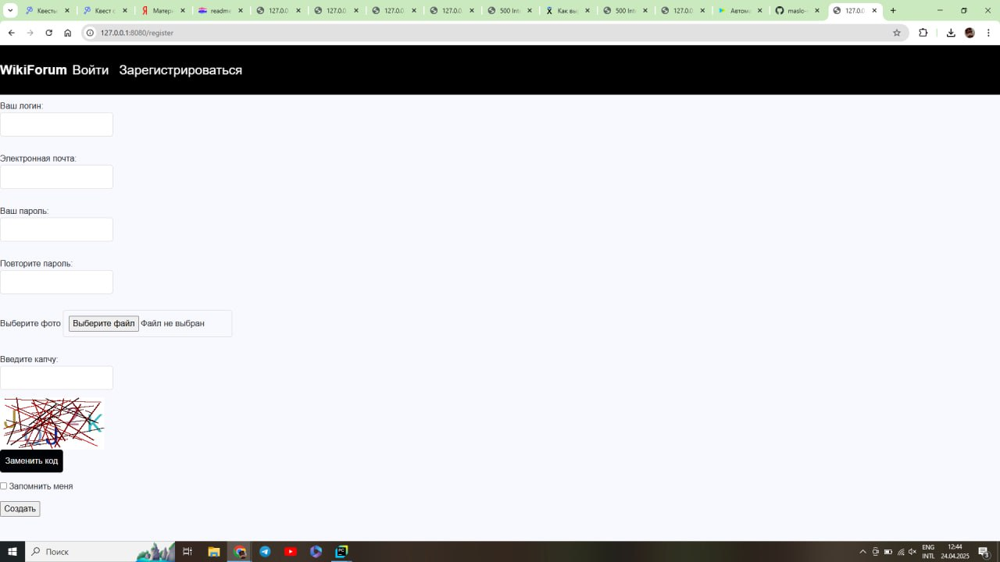
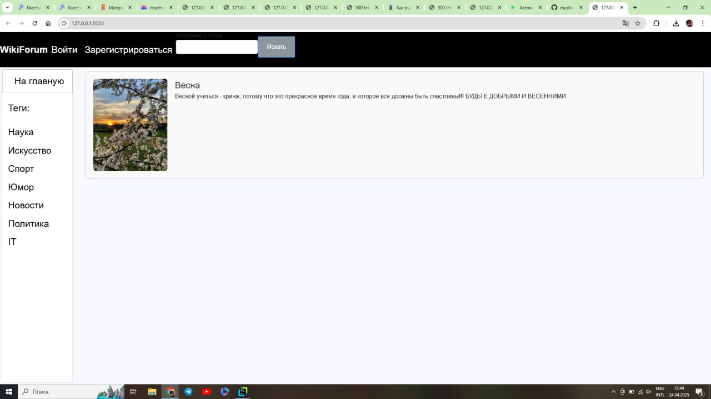
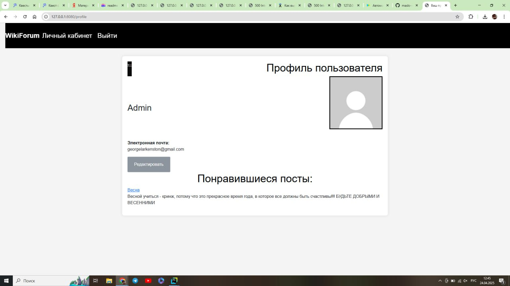
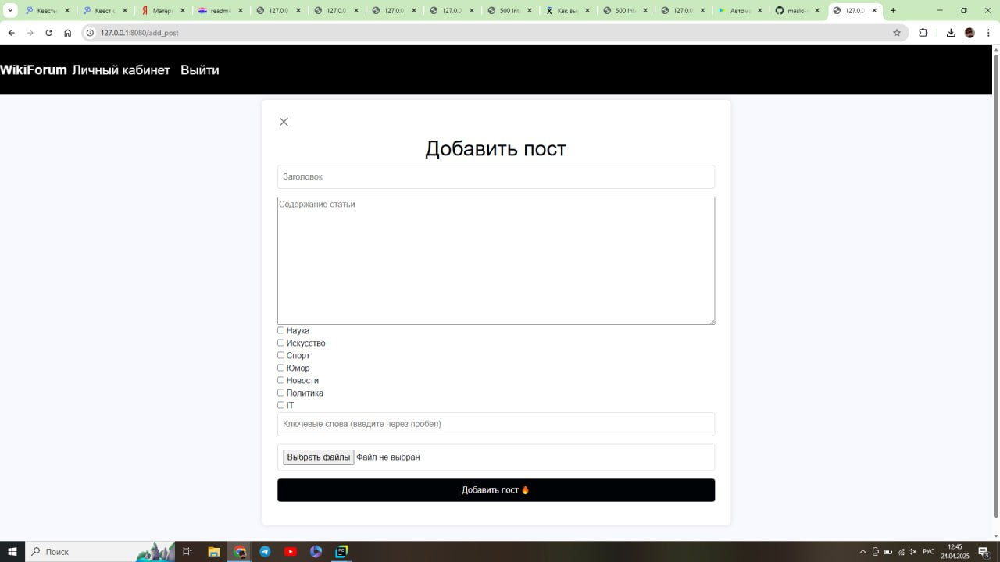

WikiForum - форум для проведения досуга: вы можете заняться прочтением различных интересных статей, а также созданием своих.
Функционал достаточно прост: сначала надо зарегистрироваться на сайте(необязательно, просто в ином случае вы не сможете писать комментариии и создавать свои статьи),
а потом перейти на вкладку "Посты", если хотите почитать, или зайти в профиль и посмотреть информацию о себе.

Вот пара скриншотов работы сайта:

Для запуска сайта необходимо установить библиотеки и модули, лежащие в файле requirements.txt.
В случае багов или ошибок пишите нам в telegram: @Liedric, @MasloPaslo, @sane4ka_GoDoB
> Ссылка на сайт в интернете: https://heartbreaking-entertaining-oviraptor.glitch.me/